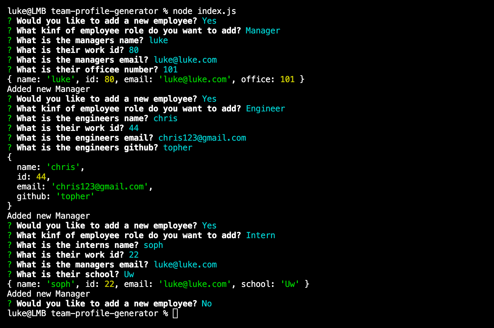
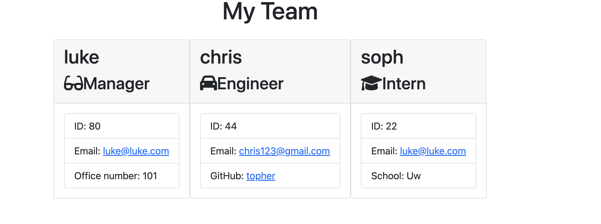

# Team Profile Generator
  ## Description
  A Node.js command line app that asks information about specfic questions retaining to a job role, the generates the information entered to the HTML page as employee cards.
  ## Table of Contents
  - [Installation](#installation)
  - [Usage](#usage)
  - [Contributing](#contributing)
  - [Tests](#tests)
  - [Questions](#questions)
  
  
  ## Installation 
  Install "Inquirer" & "Jest"
  ## Usage 
  Able to build work teams easy with cards that have their personal information.
  ## Contributing 
  No
  ## Tests 
  There were four tests that went through each role, and that it prints to the HTML.
  ## Questions
  ### GitHub
  [GitHub](https://www.github.com/L-Stew206) 
  ### Email
  luketheforce206@gmail.com
  ## Video
  link https://drive.google.com/file/d/1zuVLyPZk9spI4vsCXYtQGUESjFH8tT5-/view 
  ## Screenshots
  
  
  ##
  
  [This application is licensed under MIT](https://opensource.org/licenses/MIT)
